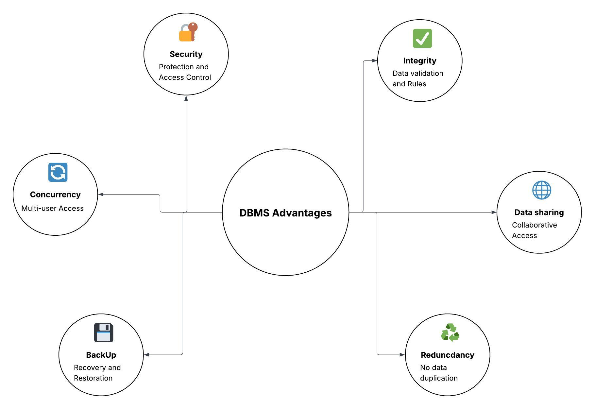

## 1. Flat File Systems vs. Relational Databases

| Aspect | Flat File System | Relational Database |
|--------|------------------|---------------------|
| **Structure** | Data stored in a single plain text or binary file. | Data organized into structured tables with defined schemas, rows, and columns. |
| **Data Redundancy** | High. Data often repeated due to lack of normalization or linking mechanisms. | Low. Uses normalization and keys to minimize redundancy and maintain consistency. |
| **Relationships** | Relationships managed manually if needed. | Supports one-to-one, one-to-many, and many-to-many relationships using foreign keys. |
| **Example Usage** | Simple storage like contact lists, log files, flat CSV exports, basic data sharing. | Business systems (CRM, inventory, finance), web apps, analytics databases. |
| **Drawbacks** | Limited scalability, manual updates, no integrity checks, prone to errors. | Requires setup and maintenance, more complex to learn. |

## 2. DBMS Advantages

## 3. Roles in a Database System

### System Analyst
- Works closely with stakeholders and clients to gather and analyze business requirements
- Acts as a bridge between users and the technical team

### Database Designer
- Designs the logical and physical structure of the database
- Creates the Entity-Relationship Diagram (ERD) to define how data is related

### Database Developer
- Builds the database based on the designer's specifications
- Writes SQL queries, stored procedures, functions, and scripts to manipulate and manage data

### Database Administrator (DBA)
- Manages database security, user access, and permissions
- Performs backups, recovery planning, and performance tuning
- Ensures the database is available, efficient, and protected against data loss or breaches

### Application Developer
- Develops applications (web, desktop, or mobile) that interact with the database
- Implements front-end interfaces and back-end logic

### Business Intelligence (BI) Developer
- Analyzes data and creates dashboards, reports, and visualizations
- Uses tools such as Power BI, Tableau, or SQL-based reporting services
- May also work on data mining, predictive analytics, and machine learning to uncover insights from data

## 4. Types of Databases

### Relational vs. Non-Relational Databases

#### Relational Databases
- Use structured tables with rows and columns to store data
- Each table has a schema, and relationships are defined using keys (primary/foreign keys)
- Data is retrieved using Structured Query Language (SQL)
- **Examples:** MySQL, PostgreSQL, Oracle, Microsoft SQL Server

#### Non-Relational Databases (NoSQL)
- Do not use a fixed table schema; can store data in various formats like documents, key-value pairs, wide-columns, or graphs
- Better suited for unstructured or semi-structured data and large-scale distributed systems
- Offer flexibility and scalability
- **Examples:**
  - **MongoDB** - Document-based NoSQL database storing data as JSON-like documents

### Centralized vs. Distributed vs. Cloud Databases

#### Centralized Database
- All data is stored and managed on a single server or location
- Simpler to maintain but can be a single point of failure
- Best for small organizations or local applications
- **Example:** A local PostgreSQL server in an office

#### Distributed Database
- Data is distributed across multiple servers or locations, but appears to users as a single database
- Improves availability, reliability, and performance in large-scale environments
- Can be more complex to manage
- **Example:** Google Spanner, Apache Cassandra

#### Cloud Database
- Hosted and managed on cloud platforms such as AWS, Azure, or Google Cloud
- Offers scalability, remote access, and pay-as-you-go pricing
- Can be either relational or non-relational
- **Examples:** Amazon RDS (relational), Firebase (non-relational), Azure Cosmos DB

## 5. Cloud Storage and Databases

Cloud storage refers to storing data on remote servers accessed via the internet, instead of on local machines or on-premise servers. It supports database functionality by providing scalable, reliable, and secure infrastructure for storing database files, backups, and large datasets. Cloud platforms also offer fully managed database services that eliminate the need to manually handle hardware, software updates, and maintenance.

### Advantages of Using Cloud-Based Databases

- **Scalability:** Easily scale resources up or down based on workload and demand
- **Accessibility:** Accessible from anywhere with an internet connection, supporting remote teams and applications
- **Managed Services:** Providers handle backups, updates, patches, and failover systems automatically
- **Cost-Efficient:** Pay-as-you-go pricing avoids large upfront hardware costs
- **High Availability & Redundancy:** Data is often replicated across multiple regions or zones to ensure uptime
- **Security:** Built-in security features including encryption, identity access management, and compliance controls

**Examples:**
- Azure SQL Database (Microsoft)
- Amazon RDS (AWS)
- Google Cloud Spanner (Google)

### Disadvantages or Challenges with Cloud-Based Databases

- **Internet Dependency:** Access to the database requires a stable internet connection
- **Latency:** Cloud latency can affect performance for high-speed transaction systems
- **Cost Over Time:** Operational costs may increase with long-term use or high data transfer volumes
- **Limited Control:** Users have less control over the underlying hardware and infrastructure
- **Data Security Concerns:** Although secure, storing sensitive data in the cloud can raise compliance and privacy concerns in regulated industries